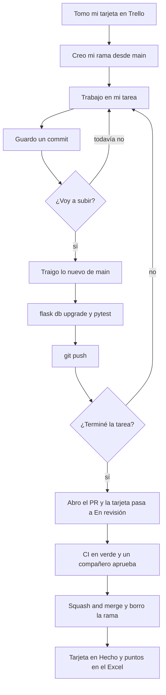

# Guía de git — cómo trabajar en equipo

Esta guía es el paso a paso para trabajar en el repositorio sin pisar el trabajo de los demás. Explica qué hacer al empezar el día, cómo subir tus cambios, cómo entregar tu tarea y qué hacer cuando git se queja.

**Orden de lectura para empezar:**

1. [Guía de inicio](GUIA-INICIO.md): instalar las herramientas y clonar el repo.
2. [Plan de trabajo](PLAN-DE-TRABAJO.md): qué te toca y a quién esperas.
3. Esta guía: cómo trabajar con git día a día.

Los comandos se ejecutan desde la carpeta del repo, **con el entorno virtual activo**. Son iguales en Windows (PowerShell) y en Linux; cuando cambian, se muestran los dos.

## Conceptos en un minuto

| Palabra | Qué es |
|---|---|
| **Commit** | Una "foto" de tus cambios con un mensaje. El historial es una cadena de commits |
| **Rama (branch)** | Una línea de trabajo paralela. Trabajas en la tuya sin tocar la de los demás |
| **`main`** | La rama principal: la versión del proyecto que siempre debe funcionar. Está protegida |
| **`origin`** | La copia del repo que está en GitHub |
| **Push** | Subir tus commits a GitHub |
| **Pull** | Traer a tu computador los commits que hay en GitHub |
| **Pull request (PR)** | La solicitud, en GitHub, para unir tu rama a `main`. Otro integrante la revisa antes |
| **Squash and merge** | La forma de unir que usamos: todos los commits del PR entran a `main` como **uno solo**, con el título del PR |
| **CI** | Las verificaciones automáticas que corren en GitHub en cada PR: migraciones y pruebas |
| **Conflicto** | Dos personas cambiaron las mismas líneas y git no sabe cuál versión dejar |
| **Migración** | Un archivo de `migrations/versions/` que crea o cambia tablas. Forman una cadena: cada una apunta a la anterior |

## Las 7 reglas

1. **Nunca trabajes en `main`.** Cada tarea tiene su propia rama.
2. **Trae lo nuevo de `main` al empezar el día y antes de subir** (`git pull origin main`), y después corre `flask db upgrade`.
3. **Haz commits pequeños**, con el código de la tarea en el mensaje: `US-02 T2: formulario de clientes`.
4. **Antes de subir, corre `pytest`.** Si falla en tu computador, fallará en el CI.
5. **Una migración por PR**, y nunca edites una migración que ya está en `main`.
6. **Nunca subas contraseñas ni tu `.env`.** Si pasa, avisa de inmediato: borrarlo en el commit siguiente no lo quita del historial.
7. **Si git dice algo que no entiendes, detente y pregunta.** Nunca uses `--force`.

## El ciclo de trabajo



## 0. Configuración única (una vez por computador)

Si seguiste la [guía de inicio](GUIA-INICIO.md) §2, ya la hiciste. Si no, además del nombre y el correo, ejecuta:

```bash
git config --global pull.rebase false
git config --global core.editor "code --wait"
```

- **`pull.rebase false`:** cuando tu rama y la de GitHub se separan, git las une con un commit de unión. Sin esto, se detiene con `Need to specify how to reconcile divergent branches`.
- **`core.editor "code --wait"`:** cuando git necesita un mensaje, abre una pestaña en VS Code en lugar de Vim. Revisa el mensaje, **cierra la pestaña** y git continúa.

## 1. Empezar una tarea (una vez por rama)

Primero revisa que tu tarea no esté esperando a otra ([¿Quién espera a quién?](PLAN-DE-TRABAJO.md#quién-espera-a-quién)). Luego crea la rama, cambiando `feature/US-02-crud-clientes` por la tuya:

```bash
git switch main
git pull
git switch -c feature/US-02-crud-clientes
git push -u origin feature/US-02-crud-clientes
```

| Comando | Qué hace |
|---|---|
| `git switch main` | Te pasa a la rama `main` |
| `git pull` | Actualiza tu `main` con lo último de GitHub, para que tu rama nazca con todo lo que ya está terminado |
| `git switch -c ...` | Crea tu rama y te pasa a ella |
| `git push -u origin ...` | Crea tu rama también en GitHub y deja enlazadas las dos. De aquí en adelante basta con `git push` |

**Nombre de la rama:** `feature/US-XX-descripcion-corta`, en minúsculas, sin tildes y con guiones.

| Tipo de trabajo | Prefijo | Ejemplo |
|---|---|---|
| Una tarea o historia del backlog | `feature/` | `feature/US-04-tablas-repuesto`, `feature/US-01-login` |
| Corregir un error que ya está en `main` | `fix/` | `fix/US-06-total-venta` |
| Solo documentación | `docs/` | `docs/acta-sprint-1` |
| Configuración, CI o dependencias | `chore/` | `chore/actualizar-flask` |

Una rama puede agrupar varias tareas de la misma historia (por ejemplo, T2 y T3), pero **la tarea que crea tablas va siempre sola**, porque su migración tiene que entrar a `main` cuanto antes (ver el [plan](PLAN-DE-TRABAJO.md#orden-de-las-migraciones)).

Para saber en qué rama estás, mira la primera línea de `git status` (`En la rama ...` o `On branch ...`). VS Code también la muestra abajo a la izquierda.

## 2. Al empezar cada día

```bash
git switch feature/US-02-crud-clientes
git status
git pull origin main
flask db upgrade
```

1. **`git switch`** asegura que estás en **tu** rama.
2. **`git status`** debe decir `nada para hacer commit` o `working tree clean`. Si muestra archivos modificados, son cambios que no guardaste la última vez: haz commit primero (paso 3).
3. **`git pull origin main`** trae lo que tus compañeros ya unieron a `main` y lo mezcla con tu rama. Si se abre una pestaña `MERGE_MSG` en VS Code, es el mensaje del commit de unión: ciérrala.
4. **`flask db upgrade`** aplica en tu base las migraciones nuevas que llegaron.

## 3. Mientras trabajas: guardar commits

Cada vez que termines algo pequeño que funcione, guarda un commit. Por ejemplo: un modelo, un formulario, una ruta, una regla del servicio o una prueba.

```bash
git status
git add .
git commit -m "US-02 T2: formulario para crear clientes"
```

- **Revisa `git status` antes de `git add .`:** solo deben aparecer archivos que quieres guardar. Si aparece `.env`, `.venv/`, `__pycache__/`, `.Rhistory` o algo que no reconoces, **pregunta antes**.
- **Formato del mensaje:** `US-XX TY: qué hiciste`, empezando con un verbo o un sustantivo que diga qué cambió.
  - Buenos: `US-04 T3: alerta de stock bajo`, `US-01 T3: bloquea páginas de otro rol`.
  - Si no es una tarea del backlog: `chore: actualiza Flask`, `docs: acta de la reunión del lunes`.
  - Malos: `cambios`, `avance`, `asdf`.
- **Hacer commit no sube nada.** Los commits quedan en tu computador hasta que hagas push.

## 4. Subir tus cambios

Sube al menos una vez al día. Así queda un respaldo y tus compañeros ven tu avance.

```bash
git pull origin main
flask db upgrade
pytest
git push
```

1. **`git pull origin main`:** traes lo nuevo de `main` **antes** de subir. Si hay un conflicto, aparece ahora, en tu rama, y lo resuelves tú (sección 7).
2. **`flask db upgrade`** y **`pytest`:** comprueban que lo nuevo de `main` y lo tuyo, juntos, funcionan. Es lo mismo que va a revisar el CI.
3. **`git push`:** sube tus commits a tu rama en GitHub. **No toca `main`.**

## 5. Terminar la tarea: el pull request

**Antes de abrirlo**, revisa la [definición de terminado](PLAN-DE-TRABAJO.md#definición-de-terminado) y haz el paso 4 una última vez.

**Abrir el PR:**

1. Entra a https://github.com/Thiago3108/repuauto. Arriba aparece un aviso con tu rama y el botón **Compare & pull request**. Si no aparece, ve a la pestaña **Pull requests → New pull request**.
2. Revisa que diga **base: `main` ← compare: `tu-rama`**.
3. **Título:** el código de la tarea y qué entrega, igual que un commit. Por ejemplo, `US-02 T2: CRUD de clientes`. Si agrupa varias tareas: `US-02 T2 y T3: CRUD y búsqueda de clientes`. **El título importa:** con *Squash and merge* se convierte en el mensaje del commit que queda en `main`, y es lo que une el código con su tarjeta de Trello.
4. **Descripción:** GitHub la llena con la [plantilla](.github/pull_request_template.md). Completa cada parte y marca las casillas.
5. En **Reviewers**, a la derecha, elige quién lo revisa (sección 6).
6. **Create pull request.**
7. Pasa la tarjeta de Trello a **En revisión** y pega en ella el enlace del PR.

**Espera el CI.** Abajo del PR aparece **CI / pruebas**. Si sale ❌, abre **Details** para ver qué falló, corrígelo en tu rama y haz `git push`: el CI corre de nuevo solo.

**Si el revisor pide cambios:** hazlos en tu misma rama, guárdalos con commit y haz `git push`. El PR se actualiza solo; **no abras otro**.

**Cuando esté aprobado y el CI en verde:**

1. **Squash and merge → Confirm squash and merge.** Revisa que el mensaje sea el título del PR.
2. GitHub borra la rama en GitHub. En tu computador, bórrala así:

   ```bash
   git switch main
   git pull
   git branch -d feature/US-02-crud-clientes
   ```

   Con *Squash and merge*, git a veces dice que la rama `is not fully merged`. Si el PR ya está unido en GitHub, bórrala con `git branch -D` (con mayúscula).
3. Pasa la tarjeta a **Hecho** y anota sus puntos en el Excel, en la semana en que terminó ([plan](PLAN-DE-TRABAJO.md#definición-de-terminado)).
4. **Avisa en el grupo** que tu tarea entró a `main`, sobre todo si traía una migración. Así tus compañeros hacen `git pull origin main` y `flask db upgrade`.

**Para tu siguiente tarea**, vuelve al paso 1: siempre se empieza desde un `main` actualizado.

## 6. Revisar el PR de un compañero

Revisar no es un trámite. Es la forma de que los cuatro entiendan el código que van a usar y puedan defenderlo en la sustentación.

**Quién revisa a quién** (propuesta, por las historias que comparten):

| Autor del PR | Revisa | Por qué |
|---|---|---|
| Santiago | Jhon | Comparten US-06 (ventas) y US-07 (reportes) |
| Jhon | Santiago | Comparten US-06 y US-07 |
| Jairo | David | Comparten US-05 (catálogo), que usa los vehículos de David |
| David | Jairo | Comparten US-05, y las compatibilidades de US-03 usan los repuestos de Jairo |

Si tu revisor no puede en un día, pídeselo a cualquiera de los otros dos. **Los PR con migración se revisan el mismo día**, porque detienen a los demás.

1. En el PR, abre la pestaña **Files changed** y lee los cambios. Para comentar una línea, usa el **+** que aparece a su lado.
2. **Qué revisar:**
   - ¿Cumple los criterios de aceptación de la historia (Excel, hoja *User Stories*)?
   - ¿Las tablas, columnas y restricciones son las de [`repuauto_bd.dbml`](docs/diagramas/repuauto_bd.dbml), con los mismos nombres?
   - ¿`routes.py` solo recibe y responde, y las reglas y las consultas están en `services.py`?
   - ¿Hay pruebas para las reglas importantes y los casos de error?
   - ¿La migración hace solo lo que dice, y trae `downgrade`?
   - ¿Entiendes el código? Si no, pide que lo expliquen con un comentario.
3. **Para probarlo en tu computador**, primero guarda tus propios cambios con commit y luego:

   ```bash
   git fetch
   git switch feature/US-02-crud-clientes
   flask db upgrade
   flask run
   ```

   Si el PR trae una migración, **antes de volver a tu rama** deshaz esa migración en tu base con `flask db downgrade`. Después vuelve con `git switch <tu-rama>`. Si no la deshaces, tu base queda con una tabla que tu rama no conoce (ver [conflictos de migraciones](#conflictos-de-migraciones)).
4. Botón **Review changes**: **Approve** si está bien, o **Request changes** con un comentario que explique qué corregir.

## 7. Conflictos

Un conflicto ocurre cuando tú y otra persona cambiaron **las mismas líneas** de un archivo. Es normal, no es un error tuyo, y se resuelve en minutos.

**Cuándo lo verás:** al hacer `git pull origin main`, git dice algo como:

```
CONFLICT (content): Merge conflict in app/models/__init__.py
Automatic merge failed; fix conflicts and then commit the result.
```

**Cómo resolverlo:**

1. Abre el archivo en VS Code. Verás bloques así:

   ```
   <<<<<<< HEAD
       (tu versión)
   =======
       (la versión que viene de main)
   >>>>>>> ...
   ```

2. Encima de cada bloque, VS Code muestra tres opciones: **Accept Current Change** (lo tuyo), **Accept Incoming Change** (lo de `main`) y **Accept Both Changes** (los dos). Si cada uno agregó algo distinto (un import, una función de `@semilla`, una fila del README), casi siempre la respuesta es **Accept Both Changes**.
3. Revisa que el archivo quede bien, sin `<<<<<<<`, `=======` ni `>>>>>>>`, y que `pytest` pase.
4. Guarda el archivo y termina la unión:

   ```bash
   git add .
   git commit --no-edit
   ```

5. Sigue con normalidad: `git push`.

**Archivos donde es más probable:** `app/models/__init__.py` (los imports de cada modelo), `app/cli.py` (las semillas), `app/menu.py`, `app/templates/base.html` y `README.md` (las casillas). Si no estás seguro de qué versión dejar, **no adivines**: pregúntale a quien escribió la otra parte.

### Conflictos de migraciones

Este es el conflicto propio de este proyecto, y **git no lo detecta**, porque son dos archivos distintos. Pasa cuando tú generaste una migración en tu rama y, mientras tanto, otra migración entró a `main`. Las dos apuntan a la misma migración anterior y la cadena se parte en dos cabezas.

El CI lo detecta en el paso **Una sola cabeza de migraciones** y el PR queda en rojo. En tu computador lo ves con:

```bash
flask db heads
```

Si muestra **dos** líneas con `(head)`, tienes que rehacer tu migración. **Sigue los pasos en este orden:**

```bash
flask db downgrade
```

1. **`flask db downgrade`** deshace tu migración en tu base. **Hazlo antes de borrar el archivo:** sin el archivo, Flask ya no sabe cómo deshacerla.
2. Borra tu archivo de `migrations/versions/`. Es el que tiene tu mensaje (`..._us_04_t1_tablas_de_repuestos.py`).
3. Trae lo nuevo y regenera la migración:

   ```bash
   git pull origin main
   flask db upgrade
   flask db migrate -m "US-04 T1: tablas de repuestos"
   flask db upgrade
   pytest
   ```

4. Abre el archivo nuevo y revisa que solo cree **tus** tablas. Si aparecen tablas de otro, tu base no estaba al día: vuelve al paso 1.
5. `git add .`, `git commit -m "US-04 T1: regenera la migración sobre main"` y `git push`.

**Si `flask db upgrade` dice `Can't locate revision identified by '...'`:** tu base tiene aplicada una migración cuyo archivo ya no existe. Por ejemplo, borraste el archivo sin hacer el `downgrade`, o probaste la rama de un compañero y volviste a la tuya. Tienes dos arreglos:

- Si el archivo existe en otra rama, pásate a esa rama, corre `flask db downgrade` y vuelve a la tuya.
- Si no, recrea tu base de trabajo (se pierden los datos de prueba que hayas cargado a mano):

  ```sql
  DROP DATABASE repuauto;
  CREATE DATABASE repuauto OWNER repuauto;
  ```

  Y después ejecuta `flask db upgrade` y `flask seed`.

## 8. Cuando git se queja

| Mensaje o situación | Qué pasó | Qué hacer |
|---|---|---|
| `Your local changes to the following files would be overwritten` | Tienes cambios sin guardar y git no quiere perderlos | Guárdalos con `git add .` y `git commit -m "..."`, y repite el comando |
| `Updates were rejected because the remote contains work that you do not have locally` | Tu rama en GitHub tiene commits que tú no tienes (por ejemplo, subiste desde otro computador) | `git pull` y luego `git push` |
| `Need to specify how to reconcile divergent branches` | Falta la configuración única | `git config --global pull.rebase false` y repite |
| `CONFLICT (content): Merge conflict in ...` | Dos personas cambiaron las mismas líneas | Sección 7 |
| El CI falla en **Una sola cabeza de migraciones** | Entró otra migración a `main` antes que la tuya | [Conflictos de migraciones](#conflictos-de-migraciones) |
| El CI falla en **Pruebas** | Algo se rompió al juntar tu rama con `main` | Abre **Details**, busca la prueba en rojo, corre `pytest` en tu computador y corrígelo |
| El botón dice **This branch is out-of-date with the base branch** | Entró algo a `main` después de tu último push | Botón **Update branch**, o `git pull origin main` y `git push` |
| `not a git repository` | Estás fuera de la carpeta del repo | Entra a la carpeta con `cd` |
| La terminal muestra una pantalla extraña con `~` a la izquierda | Es Vim: falta configurar el editor | Escribe `:wq` y presiona Enter |
| `protected branch` o `push declined` al subir a `main` | `main` está protegida y solo acepta cambios por PR | Está bien que pase. Mueve tus commits a una rama (ver abajo) |
| Hiciste commits en `main` por error | Trabajaste en la rama equivocada | Ver abajo |

**Si hiciste commits en `main` por error, todavía no los subiste y aún no habías creado tu rama de la tarea:**

```bash
git status
git branch feature/US-02-crud-clientes
git reset --hard origin/main
git switch feature/US-02-crud-clientes
```

1. `git status` tiene que decir que no hay nada pendiente. Si no, haz commit primero: el paso 3 borra lo que no esté guardado.
2. `git branch ...` crea tu rama con esos commits adentro.
3. `git reset --hard origin/main` devuelve tu `main` a como está en GitHub. Tus commits no se pierden: siguen en la rama del paso 2.
4. `git switch ...` te pasa a tu rama para seguir trabajando ahí.

Si tu rama de la tarea ya existía, **no hagas nada todavía y pide ayuda**: también tiene arreglo, pero es distinto.

## 9. Proteger `main` (Santiago, una sola vez)

El repositorio es público, así que estas reglas funcionan en el plan gratuito de GitHub. Hay que hacerlo **antes de que el equipo empiece a abrir PR**.

**Primero, la forma de unir** (**Settings → General**, sección **Pull Requests**):

1. Deja marcado solo **Allow squash merging**, con **Default commit message: Pull request title**. Desmarca **Allow merge commits** y **Allow rebase merging**.
2. Marca **Always suggest updating pull request branches**.
3. Marca **Automatically delete head branches**.

**Después, el ruleset** (**Settings → Rules → Rulesets → New ruleset → New branch ruleset**):

1. **Ruleset name:** `proteger-main`. **Enforcement status:** *Active*.
2. **Bypass list:** vacía. Así las reglas también aplican al dueño del repositorio.
3. **Target branches:** *Add target → Include default branch*.
4. Marca:
   - **Restrict deletions**
   - **Block force pushes**
   - **Require a pull request before merging**, con **Required approvals: 1**, y en **Allowed merge methods** deja solo *Squash*.
   - **Require status checks to pass**, con **Require branches to be up to date before merging**. En **Add checks**, busca y agrega **`pruebas`**. Solo aparece si el CI ya corrió al menos una vez, así que haz esto después del primer PR.
5. **Create**.

A partir de ese momento, nadie puede subir directo a `main`, ni siquiera el dueño. Todo entra por un PR con el CI en verde y la aprobación de un compañero.

La regla de **up to date** es la que protege las migraciones. Si entró otra migración a `main` después de tu último push, GitHub te obliga a actualizar la rama antes de unir, y el CI vuelve a revisar que haya una sola cabeza.

## 10. Marcar la entrega de cada sprint (Santiago)

Al cerrar cada sprint, con todo unido a `main`, se marca la versión entregada con una etiqueta. Los nombres son los del *Product Backlog* (columna REALISE):

```bash
git switch main
git pull
git tag -a v0.1-sprint1 -m "Sprint 1: cuentas, clientes, vehículos y repuestos"
git push origin v0.1-sprint1
```

| Sprint | Etiqueta |
|---|---|
| 1 | `v0.1-sprint1` |
| 2 | `v0.2-sprint2` |
| 3 | `v1.0-sprint3` |

Así queda registrado exactamente qué se entregó en cada sprint, y se puede volver a esa versión en cualquier momento. En GitHub, las etiquetas aparecen en **Releases → Tags**.

---

_Última actualización: 2026-09-29_
