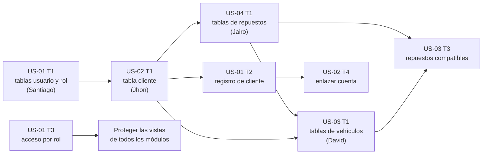

# Plan de trabajo — RepuAuto

**Ingeniería de Software II** · Universidad Industrial de Santander · 2026
**Equipo:** Santiago Martínez, Jhon Sotelo, Jairo Cardozo y David Muñoz

En este plan está qué hace cada uno, en qué orden, a quién espera y cuándo una tarea está terminada. Sale del Excel **Scrum_Trace_RepuAuto** (hojas *Product Backlog*, *Sprint Backlog Burndownchart*, *User Stories* y *Trazabilidad*). **Si cambia algo en el Excel, se cambia también aquí.**

## Índice

- [Fechas clave](#fechas-clave)
- [Quién hace qué](#quién-hace-qué)
- [¿Quién espera a quién?](#quién-espera-a-quién)
- [Orden de las migraciones](#orden-de-las-migraciones)
- [Metodología](#metodología)
- [Convenciones del código](#convenciones-del-código)
- [Definición de terminado](#definición-de-terminado)
- [Fichas por historia](#fichas-por-historia): [US-01](#us-01--registro-e-inicio-de-sesión) · [US-02](#us-02--gestionar-clientes) · [US-03](#us-03--gestionar-vehículos) · [US-04](#us-04--gestionar-repuestos-y-stock) · [US-05](#us-05--consultar-catálogo-por-vehículo) · [US-06](#us-06--registrar-venta) · [US-07](#us-07--generar-reportes) · [US-08](#us-08--estado-e-historial-de-compras) · [US-09](#us-09--registrar-compras-a-proveedores)
- [Retrospectivas](#retrospectivas)

## Fechas clave

El proyecto dura **12 semanas en 3 sprints de 4 semanas**, como en el burndown del Excel. Las fechas que faltan se llenan cuando el profesor las confirme.

| Fecha | Qué pasa |
|---|---|
| Semana 1 · _por confirmar_ | Inicio del sprint 1 (semana 1 del burndown) |
| **Vie 9 oct** | **Entrega.** _Qué se entrega: por confirmar con el profesor._ |
| Fin de la semana 4 · _por confirmar_ | Cierre del sprint 1 · etiqueta `v0.1-sprint1` |
| Fin de la semana 8 · _por confirmar_ | Cierre del sprint 2 · etiqueta `v0.2-sprint2` |
| Una semana antes de la entrega final | **Congelamiento:** desde aquí no entran funcionalidades nuevas, solo correcciones, pulido y evidencias |
| **19 o 26 de nov** _(por confirmar)_ | **Entrega final**, una semana antes de que termine el semestre · etiqueta `v1.0-sprint3` |

## Quién hace qué

Los datos son del Excel: 9 historias, 44 tareas, **77 puntos** y **183 horas estimadas**.

| Integrante | Rol Scrum | Sprint 1 | Sprint 2 | Sprint 3 | Puntos |
|---|---|---|---|---|---|
| Santiago Martínez | _por definir_ | US-01 completa (10) | US-06 T3 y T4 (5) | US-07 T3 y T4 (4) | 19 |
| Jhon Sotelo | _por definir_ | US-02 completa (7) | US-06 T1, T2 y T5 (10) | US-07 T1, US-09 T2 y T4 (6) | 23 |
| Jairo Cardozo | _por definir_ | US-04 completa (8) | US-05 T1, T3 y T4 (5) | US-07 T2, US-09 T1 y T3 (6) | 19 |
| David Muñoz | _por definir_ | US-03 completa (8) | US-05 T2 (3) | US-08 completa (5) | 16 |
| **Total por sprint** | | **33** | **23** | **21** | **77** |

**Roles Scrum:** hay que definir quién es Product Owner y quién es Scrum Master (puede rotar por sprint), y anotarlo aquí y en el [README](README.md#equipo).

## ¿Quién espera a quién?

La regla es simple: **las tareas que crean tablas van primero y entran a `main` cuanto antes**, porque las demás las necesitan.

### Mientras esperas, avanza en esto

Mientras la tabla de otro no entra a `main`, puedes avanzar en lo que no la necesita:

- el formulario (WTForms) y sus validaciones;
- la plantilla de la vista con Bootstrap, con datos de ejemplo escritos a mano;
- las funciones de `services.py` y sus pruebas, si tus tablas ya existen.

### Sprint 1



| Tarea | Espera a | Por qué |
|---|---|---|
| US-04 T1 (tablas de repuestos) | US-02 T1 | No usa sus tablas, pero las migraciones entran de una en una ([orden](#orden-de-las-migraciones)) |
| US-02 T1 (tabla `cliente`) | US-01 T1 | `cliente.id_usuario` apunta a `usuario` |
| US-03 T1 (tablas de vehículos) | US-04 T1 | `repuesto_vehiculo` apunta a `repuesto` |
| US-01 T2 (registro de cliente) | US-02 T1 | Al registrarse se crea o se busca el `cliente` por cédula |
| US-02 T4 (enlazar cuenta) | US-01 T2 | Necesita cuentas de cliente para enlazar |
| US-03 T3 (compatibilidades) | US-03 T1 y US-04 T1 | Asocia vehículos con repuestos |
| Vistas limitadas por rol (UI-09 para vendedor, UI-11 solo administrador, etc.) | US-01 T3 | El control de acceso por rol es de Santiago. Hasta que entre, las vistas quedan abiertas y cada dueño las protege después |

**Santiago empieza por US-01 T1 y T3**, porque las demás historias dependen de ellas. **Jairo empieza por US-04 T1**, en cuanto entre US-02 T1.

### Sprint 2

| Tarea | Espera a |
|---|---|
| US-05 (catálogo) | US-03 y US-04 terminadas |
| US-06 T1 (tablas de ventas) | US-01 T1, US-02 T1 y US-04 T1 (usa `usuario`, `cliente` y `repuesto`) |
| US-06 T2, T3 y T4 | US-06 T1. **Jhon y Santiago acuerdan antes** qué función de `services.py` guarda la venta, porque T2 (Jhon) arma la venta y T3 (Santiago) verifica y descuenta el stock en la misma transacción |

### Sprint 3

| Tarea | Espera a |
|---|---|
| US-07 (reportes) | US-06 terminada: los reportes de ventas usan ventas **Completadas** |
| US-08 (mis compras) | US-06 terminada y US-02 T4 (cuenta enlazada a un cliente) |
| US-09 T1 (tablas de compras) | US-04 T1 |
| US-09 T2, T3 y T4 | US-09 T1 |

## Orden de las migraciones

Cada migración se une a `main` **antes** de generar la siguiente, porque las tablas dependen entre sí. Cada archivo de modelo sigue exactamente el grupo de tablas del [DBML](docs/diagramas/repuauto_bd.dbml).

| # | Sprint | Archivo del modelo | Tablas | Tarea | Quién |
|---|---|---|---|---|---|
| 1 | 1 | `app/models/usuario.py` | `rol`, `usuario` | US-01 T1 | Santiago |
| 2 | 1 | `app/models/cliente.py` | `cliente` | US-02 T1 | Jhon (la hizo Santiago) |
| 3 | 1 | `app/models/repuesto.py` | `categoria`, `marca_repuesto`, `repuesto` | US-04 T1 | Jairo |
| 4 | 1 | `app/models/vehiculo.py` | `marca_vehiculo`, `vehiculo`, `repuesto_vehiculo` | US-03 T1 | David |
| 5 | 2 | `app/models/venta.py` | `estado_venta`, `venta`, `detalle_venta` | US-06 T1 | Jhon |
| 6 | 3 | `app/models/compra.py` | `proveedor`, `compra`, `detalle_compra` | US-09 T1 | Jairo |

**Para crear o cambiar tablas:**

```bash
git switch main && git pull     # trae las migraciones de los demás
flask db upgrade                # aplícalas en tu base
git switch -c feature/US-04-tablas-repuesto
# escribe el modelo e impórtalo en app/models/__init__.py
flask db migrate -m "US-04 T1: tablas de repuestos"
flask db upgrade
pytest
```

- **Revisa el archivo que se generó** en `migrations/versions/` antes de hacer commit. Autogenerate a veces no detecta todo: por ejemplo, los `CHECK` y los cambios de tipo. Si falta algo, agrégalo a mano.
- **Revisa que `downgrade()` deshaga lo que hace `upgrade()`**. Luego pruébalo: `flask db downgrade` y después `flask db upgrade` otra vez.
- **Una migración por PR.** Si antes de unir tu PR entra otra migración a `main`, rehaz la tuya ([guía de git](GUIA-GIT.md#conflictos-de-migraciones)).
- **Nunca edites una migración que ya está en `main`.** Para cambiar una tabla, crea una migración nueva.
- **Si más adelante necesitas una columna nueva**, avisa en el grupo antes de generar la migración, para que nadie genere otra en paralelo.

## Metodología

Usamos **Scrum** con sprints de 4 semanas.

| Evento | Cuándo | Qué se hace |
|---|---|---|
| Planeación del sprint | Primer día del sprint | Se revisan las tarjetas del sprint y se validan puntos y horas con [planning poker](https://www.scrumpoker-online.org/es/) (las filas amarillas del Excel son propuestas) |
| Seguimiento | Cada viernes | Cada uno actualiza sus tarjetas en Trello, y en el Excel el **ESTADO** y las **Horas reales** de sus tareas. Si una tarea terminó esa semana, anota sus puntos en la columna de la semana |
| Revisión del sprint | Último día del sprint | Se muestra lo terminado funcionando en la app, desde `main` |
| Retrospectiva | Después de la revisión | Qué funcionó, qué no y un cambio concreto para el siguiente sprint. Se anota [abajo](#retrospectivas) |
| Actas | Cada reunión | Se guardan en `docs/actas/`, con el nombre `AAAA-MM-DD-tema.md` |

**Reglas del burndown** (del Excel, hoja *Sprint Backlog Burndownchart*):

1. Escriban solo en las filas de las tareas. Las filas de las historias se calculan solas.
2. Los puntos de una tarea se anotan **completos**, en la semana en que cumplió la [definición de terminado](#definición-de-terminado). No se anotan avances parciales.
3. Dejen en blanco las semanas que no han pasado. Si una semana pasó sin tareas terminadas, escriban `0` en cualquier tarea de esa semana, para que la línea *Real* continúe.
4. Estados: `TO DO`, `IN PROGRESS` y `DONE`.

**Matriz de trazabilidad** (hoja *Trazabilidad*): de cada historia se llega a sus casos de uso, vistas, tablas, módulo y archivo de pruebas, y al revés. Si cambias una historia, una vista o una tabla, actualízala en el mismo PR.

## Convenciones del código

### Capas (MVC)

| Archivo | Hace | No hace |
|---|---|---|
| `app/<módulo>/routes.py` | Recibe la petición, valida el formulario, llama al servicio, elige la plantilla y muestra los mensajes (`flash`) | No consulta la base de datos ni aplica reglas de negocio |
| `app/<módulo>/services.py` | Aplica las reglas de negocio (stock, estados, validaciones que dependen de datos), consulta y guarda. Aquí van las transacciones | No usa `request`, `render_template` ni `flash` |
| `app/models/*.py` | Declara las tablas con SQLAlchemy | No tiene lógica de negocio |
| `app/templates/<módulo>/*.html` | Muestra los datos. Extiende `base.html` | No calcula nada importante |

Si una regla se puede probar sin navegador, va en `services.py` y tiene su prueba.

### Modelos

- Un archivo por grupo de tablas (ver el [orden de las migraciones](#orden-de-las-migraciones)), importado en `app/models/__init__.py`.
- **Los nombres exactos del DBML:** tablas, columnas, longitudes y restricciones. Los `CHECK` llevan el nombre del DBML (`chk_repuesto_stock`, etc.).
- Estilo SQLAlchemy 2 con `Mapped` y `mapped_column`:

```python
from sqlalchemy.orm import Mapped, mapped_column

from app.extensions import db


class Categoria(db.Model):
    __tablename__ = "categoria"

    id_categoria: Mapped[int] = mapped_column(primary_key=True)
    nombre: Mapped[str] = mapped_column(db.String(60), unique=True)
```

### Datos iniciales

Los catálogos (roles, estados de venta, categorías y marcas) y el primer administrador se cargan con `flask seed`. Quien crea la tabla agrega su función en `app/cli.py`, marcada con `@semilla`. La función tiene que poder correr varias veces sin duplicar nada: **primero revisa si el dato ya existe**.

### Transacciones

Las operaciones que tocan el stock (**US-06 T3 y T4** y **US-09 T3**) se hacen en **una sola transacción**. Si algo falla, se hace `db.session.rollback()` y no se guarda nada. Cada caso lleva una prueba que compruebe que el stock queda igual cuando la operación falla.

### Menú y roles

El menú lateral está en `app/menu.py`, con los roles que ven cada opción, según la decisión D3. Si agregas una vista al menú, agrégala ahí. Cada usuario ve solo las opciones de su rol.

- **Toda la app pide iniciar sesión.** No tienes que hacer nada para eso: quien no ha entrado va a la pantalla de login.
- **Ocultar una opción del menú no protege la vista.** Cada ruta se protege con `@rol_requerido`, con los mismos roles del menú:

  ```python
  from app.auth.decoradores import rol_requerido

  @bp.get("/")
  @rol_requerido("vendedor", "administrador")
  def index():
      ...
  ```

  Si el usuario no tiene el rol, ve la página "No tienes permiso" (error 403). El usuario que inició sesión está en `current_user` (`from flask_login import current_user`), por ejemplo para guardar quién registró una venta.
- **En las pruebas**, las fixtures `crear_cuenta` e `iniciar_sesion` de `tests/conftest.py` crean una cuenta del rol que necesites y entran con ella:

  ```python
  def test_el_vendedor_ve_los_clientes(client, crear_cuenta, iniciar_sesion):
      iniciar_sesion(crear_cuenta("vendedor"))
      assert client.get("/clientes/").status_code == 200
  ```

### Pruebas

- Un archivo por módulo, con el nombre de la matriz de trazabilidad: `tests/test_auth.py`, `tests/test_clientes.py`, `tests/test_vehiculos.py`, `tests/test_repuestos.py`, `tests/test_catalogo.py`, `tests/test_ventas.py`, `tests/test_reportes.py`, `tests/test_historial.py` y `tests/test_compras.py`.
- Usa los *fixtures* `app` y `client` de `tests/conftest.py`. Cada prueba empieza con la base vacía.
- Se prueban **los criterios de aceptación**: el caso normal, los errores (cédula repetida, stock insuficiente, precio negativo) y el acceso por rol.

### Estilo

- Código, variables, funciones, rutas y mensajes, en **español**. Los nombres, en `snake_case`, y las clases, en `PascalCase`.
- Un *docstring* corto al inicio de cada archivo que diga qué hace. Ver los que ya existen en `app/`.
- Formularios con Flask-WTF: la protección CSRF ya está activada. Cada módulo pone los suyos en `app/<módulo>/forms.py` (ejemplo: `app/auth/forms.py`).
- En las plantillas, dibuja cada campo con el macro `campo`, que muestra la etiqueta, el estilo de Bootstrap y los errores:

  ```html
  
  {{ campo(form.cedula) }}
  {{ campo(form.correo, "email") }}
  ```

## Definición de terminado

Una tarea está terminada cuando cumple todo esto:

- [ ] Cumple los criterios de aceptación de su historia (Excel, hoja *User Stories*)
- [ ] Tiene pruebas y `pytest` pasa en tu computador
- [ ] Las tablas, columnas y restricciones coinciden con el [DBML](docs/diagramas/repuauto_bd.dbml)
- [ ] Si trae migración: fue revisada a mano, su `downgrade` funciona y no hay dos cabezas (`flask db heads`)
- [ ] Si trae datos de catálogo: están en `flask seed` y se puede correr dos veces
- [ ] Si cambió una historia, una vista o una tabla: la matriz de trazabilidad está actualizada
- [ ] El PR fue revisado y aprobado por otro integrante, el CI está en verde y se unió con **Squash and merge**
- [ ] La tarjeta está en **Hecho** y sus puntos están en el Excel, en la semana en que terminó
- [ ] Si la tarea cerró una historia: su casilla está marcada en el [README](README.md#estado)

---

## Fichas por historia

Cada ficha resume lo que hay que construir. Los criterios de aceptación completos están en el Excel.

### US-01 — Registro e inicio de sesión

**Responsable:** Santiago · **Sprint:** 1 · **Puntos:** 10 · **Horas est.:** 26 · **Épica:** EP-01 Cuentas y acceso
**Módulo:** `app/auth` · **Vistas:** UI-01, UI-02, UI-03, UI-13 · **Tablas:** `usuario`, `rol`, `cliente` · **Pruebas:** `tests/test_auth.py`

| Tarea | Horas | Puntos | Rama sugerida |
|---|---|---|---|
| T1 · Crear tablas USUARIO y ROL | 4 | 2 | `feature/US-01-tablas-usuario` |
| T2 · Formulario de registro de cliente con validaciones | 6 | 2 | `feature/US-01-registro` |
| T3 · Inicio de sesión y control de acceso por rol | 8 | 3 | `feature/US-01-login` |
| T4 · Crear cuentas de vendedor desde el administrador (UI-13) | 5 | 2 | `feature/US-01-cuentas-vendedor` |
| T5 · Pruebas de registro, inicio de sesión y cuentas | 3 | 1 | con la tarea que prueba |

**Claves:**

- Registro: nombres y apellidos solo con letras y espacios, cédula solo con números, correo válido y único. La contraseña tiene más de 8 caracteres, al menos un número y un carácter especial, y se guarda **solo el hash**.
- Si la cédula ya existe como cliente de mostrador, la cuenta se crea sin enlazar y se avisa que un vendedor la enlazará.
- Login con correo y contraseña. Si falla, se muestra un **mensaje genérico**. Una cuenta desactivada no entra.
- Cada rol ve solo su menú, y las páginas de otro rol se bloquean. Se usa Flask-Login, que ya está en `requirements.txt`.
- El primer administrador se crea con `flask seed`.

### US-02 — Gestionar clientes

**Responsable:** Jhon · **Sprint:** 1 · **Puntos:** 7 · **Horas est.:** 19 · **Épica:** EP-02 Clientes
**Módulo:** `app/clientes` · **Vista:** UI-08 · **Tablas:** `cliente`, `usuario` · **Pruebas:** `tests/test_clientes.py`

| Tarea | Horas | Puntos | Rama sugerida |
|---|---|---|---|
| T1 · Crear tabla CLIENTE | 2 | 1 | `feature/US-02-tabla-cliente` |
| T2 · CRUD de clientes (crear, editar, ver detalles) | 5 | 2 | `feature/US-02-crud-clientes` |
| T3 · Búsqueda por nombre, cédula o teléfono | 3 | 1 | `feature/US-02-busqueda` |
| T4 · Enlazar la cuenta de un cliente verificando su cédula | 3 | 1 | `feature/US-02-enlazar-cuenta` |
| T5 · Vista "Gestión de clientes" (UI-08) | 4 | 1 | con T2 |
| T6 · Pruebas del módulo | 2 | 1 | con cada tarea |

**Claves:**

- La cédula es obligatoria, numérica y única. Si ya existe, se muestra ese cliente.
- La búsqueda acepta coincidencias parciales.
- Una cuenta se enlaza a un solo cliente.
- **No se borran clientes con ventas.**

### US-03 — Gestionar vehículos

**Responsable:** David · **Sprint:** 1 · **Puntos:** 8 · **Horas est.:** 19 · **Épica:** EP-03 Inventario y catálogo
**Módulo:** `app/vehiculos` · **Vista:** UI-11 · **Tablas:** `vehiculo`, `marca_vehiculo`, `repuesto_vehiculo` · **Pruebas:** `tests/test_vehiculos.py`

| Tarea | Horas | Puntos | Rama sugerida |
|---|---|---|---|
| T1 · Crear tablas VEHICULO y MARCA_VEHICULO (y REPUESTO_VEHICULO) | 3 | 1 | `feature/US-03-tablas-vehiculo` |
| T2 · CRUD de vehículos | 6 | 3 | `feature/US-03-crud-vehiculos` |
| T3 · Asociar repuestos compatibles | 5 | 2 | `feature/US-03-compatibles` |
| T4 · Vista "Gestión de vehículos" (UI-11) y pruebas | 5 | 2 | con T2 y T3 |

**Claves:**

- Un vehículo tiene marca, línea, referencia opcional y un año de 4 dígitos.
- Las marcas de vehículo van **aparte** de las marcas de repuesto.
- Al eliminar un vehículo se eliminan sus compatibilidades, pero **no los repuestos**.
- Las compatibilidades no se duplican.
- Solo el administrador entra a esta vista.

### US-04 — Gestionar repuestos y stock

**Responsable:** Jairo · **Sprint:** 1 · **Puntos:** 8 · **Horas est.:** 19 · **Épica:** EP-03 Inventario y catálogo
**Módulo:** `app/repuestos` · **Vistas:** UI-09, UI-10 · **Tablas:** `repuesto`, `categoria`, `marca_repuesto` · **Pruebas:** `tests/test_repuestos.py`

| Tarea | Horas | Puntos | Rama sugerida |
|---|---|---|---|
| T1 · Crear tablas REPUESTO, CATEGORIA y MARCA_REPUESTO | 3 | 1 | `feature/US-04-tablas-repuesto` |
| T2 · CRUD de repuestos (código, precio, categoría, marca) | 6 | 3 | `feature/US-04-crud-repuestos` |
| T3 · Ajustar stock y alertas de stock bajo | 5 | 2 | `feature/US-04-stock` |
| T4 · Vistas "Stock y alertas" (UI-09) y "Gestión de repuestos" (UI-10) y pruebas | 5 | 2 | con T2 y T3 |

**Claves:**

- El código es único, el precio no puede ser negativo y el stock nunca queda por debajo de cero.
- Solo el administrador crea y edita repuestos y ajusta el stock.
- Un repuesto con ventas **no se borra**: se desactiva y sale del catálogo.
- UI-09 muestra en alerta los repuestos cuyo stock actual está por debajo del mínimo, y la ven el vendedor y el administrador.

### US-05 — Consultar catálogo por vehículo

**Responsable:** Jairo, con David · **Sprint:** 2 · **Puntos:** 8 · **Horas est.:** 18 · **Épica:** EP-03
**Módulo:** `app/catalogo` · **Vista:** UI-04 · **Tablas:** `repuesto`, `repuesto_vehiculo`, `vehiculo`, `marca_vehiculo`, `categoria` · **Pruebas:** `tests/test_catalogo.py`

| Tarea | Quién | Horas | Puntos |
|---|---|---|---|
| T1 · Listar repuestos con categoría y marca | Jairo | 5 | 2 |
| T2 · Filtro por marca, línea y año del vehículo | David | 5 | 3 |
| T3 · Vista "Catálogo" (UI-04) | Jairo | 6 | 2 |
| T4 · Pruebas del catálogo | Jairo | 2 | 1 |

**Claves:**

- Solo aparecen los repuestos **activos**, con su disponibilidad (en stock o agotado).
- Se busca por nombre o código y se filtra por categoría.
- El filtro por vehículo va **en cascada**: marca, luego línea y luego año.
- Si no hay resultados, se muestra un mensaje claro.
- Lo usan los tres roles.

### US-06 — Registrar venta

**Responsable:** Jhon, con Santiago · **Sprint:** 2 · **Puntos:** 15 · **Horas est.:** 31 · **Épica:** EP-04 Ventas
**Módulo:** `app/ventas` · **Vistas:** UI-06, UI-07 · **Tablas:** `venta`, `detalle_venta`, `estado_venta`, `repuesto`, `cliente` · **Pruebas:** `tests/test_ventas.py` · **Diagrama:** [actividades de registrar venta](docs/diagramas/actividades_registrar_venta.png)

| Tarea | Quién | Horas | Puntos |
|---|---|---|---|
| T1 · Crear tablas VENTA, DETALLE_VENTA y ESTADO_VENTA | Jhon | 4 | 2 |
| T2 · Registrar venta (cliente, repuestos, método de pago) | Jhon | 10 | 5 |
| T3 · Verificar stock y descontarlo al guardar (una transacción) | Santiago | 6 | 3 |
| T4 · Completar o cancelar ventas; al cancelar, devolver el stock (UI-07) | Santiago | 5 | 2 |
| T5 · Vista "Registro de venta" (UI-06), confirmación y pruebas | Jhon | 6 | 3 |

**Claves:**

- La venta exige un cliente (se busca por cédula), al menos un repuesto con cantidad mayor que 0 y un método de pago: Efectivo, Tarjeta o Transferencia.
- El precio unitario se **copia** del precio vigente, y el total se calcula solo.
- Si un repuesto no tiene stock suficiente, **no se guarda nada** y se dice cuál falta.
- La venta queda *Completada* o *Pendiente*. Si se cancela, **devuelve el stock**.
- Se registra qué vendedor hizo la venta.

### US-07 — Generar reportes

**Responsable:** Santiago, con Jhon y Jairo · **Sprint:** 3 · **Puntos:** 8 · **Horas est.:** 19 · **Épica:** EP-05 Reportes
**Módulo:** `app/reportes` · **Vista:** UI-12 · **Tablas:** `venta`, `detalle_venta`, `repuesto`, `cliente` · **Pruebas:** `tests/test_reportes.py`

| Tarea | Quién | Horas | Puntos |
|---|---|---|---|
| T1 · Reporte de ventas | Jhon | 5 | 2 |
| T2 · Reporte de inventario | Jairo | 4 | 2 |
| T3 · Reporte de clientes | Santiago | 3 | 1 |
| T4 · Vista "Reportes" (UI-12) y pruebas | Santiago | 7 | 3 |

**Claves:**

- **Ventas:** total vendido y número de ventas por rango de fechas y por mes, contando **solo las Completadas**.
- **Inventario:** repuestos por categoría y estado del stock (en stock, bajo o agotado).
- **Clientes:** clientes nuevos por periodo y los que más compran.
- Solo el administrador ve los reportes.

### US-08 — Estado e historial de compras

**Responsable:** David · **Sprint:** 3 · **Puntos:** 5 · **Horas est.:** 13 · **Épica:** EP-04 Ventas
**Módulo:** `app/ventas` · **Vista:** UI-05 · **Tablas:** `venta`, `detalle_venta`, `estado_venta`, `cliente` · **Pruebas:** `tests/test_historial.py`

| Tarea | Horas | Puntos |
|---|---|---|
| T1 · Consultar el estado de la venta del cliente | 3 | 1 |
| T2 · Historial de compras del cliente | 4 | 2 |
| T3 · Vista "Mis compras" (UI-05) | 4 | 1 |
| T4 · Pruebas del módulo | 2 | 1 |

**Claves:**

- Muestra solo las ventas del cliente que inició sesión, de la más reciente a la más antigua, con código `#VTA`, fecha, número de productos, total y estado.
- Si la cuenta no está enlazada, se avisa que un vendedor debe enlazarla.
- **Un cliente nunca ve compras de otro**, aunque cambie el código en la URL. Esto necesita su propia prueba.
- Agrega "Mis compras" al menú del cliente en `app/menu.py`.

### US-09 — Registrar compras a proveedores

**Responsable:** Jairo y Jhon · **Sprint:** 3 · **Puntos:** 8 · **Horas est.:** 19 · **Épica:** EP-06 Compras a proveedores
**Módulo:** `app/compras` · **Vista:** UI-14 · **Tablas:** `proveedor`, `compra`, `detalle_compra`, `repuesto` · **Pruebas:** `tests/test_compras.py`

| Tarea | Quién | Horas | Puntos |
|---|---|---|---|
| T1 · Crear tablas PROVEEDOR, COMPRA y DETALLE_COMPRA | Jairo | 3 | 1 |
| T2 · CRUD de proveedores | Jhon | 5 | 2 |
| T3 · Registrar compra y sumar al stock (una transacción) | Jairo | 6 | 3 |
| T4 · Vista "Proveedores y compras" (UI-14) y pruebas | Jhon | 5 | 2 |

**Claves:**

- El proveedor tiene un NIT único y un nombre. El teléfono y el correo son opcionales.
- La compra exige al menos un repuesto con cantidad mayor que 0 y un costo no negativo. El total se calcula solo.
- Las cantidades se suman al stock **en la misma transacción**.
- Se registra qué administrador hizo la compra.
- Solo el administrador entra a esta vista.

---

## Retrospectivas

| Sprint | Qué funcionó | Qué no | Qué cambiamos |
|---|---|---|---|
| 1 | | | |
| 2 | | | |
| 3 | | | |

---

_Última actualización: 2026-09-29_
