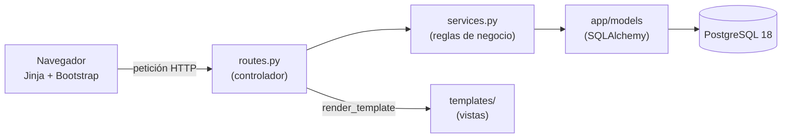

# 🔧 RepuAuto


[](https://github.com/Thiago3108/repuauto/actions/workflows/ci.yml)

**Ingeniería de Software II** · Universidad Industrial de Santander (UIS) · 2026 · Próxima entrega: **9 de octubre** · Entrega final: **19 o 26 de noviembre** _(por confirmar)_

Sistema web de gestión para una **serviteca de repuestos para carro**. El catálogo se puede filtrar por vehículo, las ventas controlan el stock y hay módulos de clientes, compras a proveedores y reportes. Cada persona entra con su cuenta y solo ve lo que corresponde a su rol: **cliente**, **vendedor** o **administrador**.

## Qué hace

1. **Cuentas y acceso (US-01):** el cliente se registra solo y el administrador crea las cuentas de los vendedores. Cada rol ve su propio menú.
2. **Clientes (US-02):** el vendedor registra, busca y actualiza clientes de mostrador, y enlaza su cuenta verificando la cédula.
3. **Vehículos (US-03):** el administrador registra los vehículos y los repuestos compatibles con cada uno.
4. **Repuestos y stock (US-04):** tiene códigos, precios, categorías, marcas, ajustes de stock y alertas de stock bajo.
5. **Catálogo por vehículo (US-05):** se busca por nombre o código y se filtra en cascada por marca, línea y año.
6. **Ventas (US-06):** el stock se verifica y se descuenta en una sola transacción. Una venta se puede completar o cancelar, y al cancelarla el stock se devuelve.
7. **Reportes (US-07):** hay reportes de ventas, inventario y clientes.
8. **Mis compras (US-08):** el cliente ve el estado y el historial de sus compras.
9. **Compras a proveedores (US-09):** cada compra suma las cantidades al stock.

## Arquitectura



Es una aplicación **Flask en tres capas** con el patrón **MVC**. Cada historia es un *blueprint* en `app/<módulo>/`:

- `routes.py` recibe la petición y elige la vista;
- `services.py` aplica las reglas de negocio y es el único que toca la base de datos;
- los modelos de `app/models/` siguen exactamente el diagrama [`repuauto_bd.dbml`](docs/diagramas/repuauto_bd.dbml).

Las tablas se crean y se cambian **solo con migraciones** (Flask-Migrate).

## Documentación

**¿Eres del equipo y vas a empezar?** Lee en este orden: [guía de inicio](GUIA-INICIO.md) → [plan de trabajo](PLAN-DE-TRABAJO.md) → [guía de git](GUIA-GIT.md) → [guía de Trello](docs/guias/TRELLO.md). Quién espera a quién está en el [plan](PLAN-DE-TRABAJO.md#quién-espera-a-quién).

| Documento | Contenido |
|---|---|
| [Plan de trabajo](PLAN-DE-TRABAJO.md) | Fechas, quién hace qué, quién espera a quién, convenciones de código y base de datos, definición de terminado y una ficha por historia |
| [Guía de inicio](GUIA-INICIO.md) | Instalar Python, PostgreSQL 18 y VS Code, crear las bases de datos, el `.env` y arrancar la app (Windows y Linux) |
| [Guía de git](GUIA-GIT.md) | Ramas, commits, pull requests, revisión, conflictos (incluidos los de migraciones) y protección de `main` |
| [Guía de Trello](docs/guias/TRELLO.md) | Listas del tablero, cómo cargar las tarjetas, etiquetas y cómo mover cada tarjeta |
| [Evidencias](EVIDENCIAS.md) | Participación de cada integrante y trazabilidad de cada historia hasta su código y sus pruebas |
| [Diagrama de la base de datos](docs/diagramas/repuauto_bd.dbml) | Todas las tablas, columnas, restricciones y relaciones. Se ve en [dbdiagram.io](https://dbdiagram.io) |
| [Casos de uso](docs/diagramas/casos_de_uso.png) | Diagrama de casos de uso ([fuente .puml](docs/diagramas/casos_de_uso.puml)) |
| [Vistas por usuario](docs/diagramas/vistas_usuario.png) | Qué vistas (UI-01 a UI-14) ve cada rol ([fuente .puml](docs/diagramas/vistas_usuario.puml)) |
| [Actividades: registrar venta](docs/diagramas/actividades_registrar_venta.png) | Flujo de una venta con verificación de stock ([fuente .puml](docs/diagramas/actividades_registrar_venta.puml)) |
| [Actas](docs/actas/) | Actas de las reuniones del equipo |

El backlog, las historias con sus criterios de aceptación, la matriz de trazabilidad y el burndown están en el Excel **Scrum_Trace_RepuAuto** que tiene el equipo. El tablero de Trello se comparte por invitación.

## Estructura del repositorio

```
app/
├── __init__.py          fábrica create_app()
├── extensions.py        base de datos, migraciones y protección CSRF
├── menu.py              menú lateral por rol
├── cli.py               comando flask seed (datos iniciales)
├── models/              modelos de la base de datos
├── auth/                US-01 Cuentas y acceso
├── clientes/            US-02 Clientes
├── vehiculos/           US-03 Vehículos
├── repuestos/           US-04 Repuestos y stock
├── catalogo/            US-05 Catálogo
├── ventas/              US-06 Ventas y US-08 Mis compras
├── reportes/            US-07 Reportes
├── compras/             US-09 Proveedores y compras
├── templates/           vistas (Jinja)
└── static/              CSS, JS e imágenes
migrations/              historial de la base de datos (Flask-Migrate)
tests/                   pruebas (pytest)
docs/
├── diagramas/           .puml, .png y el .dbml de la base de datos
├── actas/               actas de reunión
└── guias/               guía de Trello
.github/                 CI y plantilla de pull request
GUIA-INICIO.md           instalación y primer arranque
PLAN-DE-TRABAJO.md       tareas, fechas y convenciones
GUIA-GIT.md              cómo trabajar con git
EVIDENCIAS.md            participación y trazabilidad
```

## Cómo ejecutar

La primera vez, sigue la [guía de inicio](GUIA-INICIO.md). Después, cada día basta con esto:

| Paso | Linux | Windows (PowerShell) |
|---|---|---|
| Activar el entorno | `source .venv/bin/activate` | `.venv\Scripts\Activate.ps1` |
| Aplicar las migraciones nuevas | `flask db upgrade` | `flask db upgrade` |
| Cargar los datos iniciales | `flask seed` | `flask seed` |
| Arrancar | `flask run` | `flask run` |
| Probar | `pytest` | `pytest` |

La app queda en http://127.0.0.1:5000. PostgreSQL arranca solo con el computador.

## Estado

Los sprints duran 4 semanas cada uno (sprint 1: semanas 1 a 4, sprint 2: semanas 5 a 8 y sprint 3: semanas 9 a 12). La casilla se marca en el mismo pull request que termina la historia.

### Base del proyecto

- [x] Diagramas: casos de uso, vistas por usuario, actividades y base de datos
- [x] Esqueleto de la app: fábrica, blueprints, migraciones, pruebas y CI
- [x] Guías del equipo: inicio, git, plan, Trello y evidencias
- [ ] Protección de `main` en GitHub ([guía de git](GUIA-GIT.md#9-proteger-main-santiago-una-sola-vez))
- [ ] Tablero de Trello con las tarjetas del sprint 1

### Sprint 1 — Cuentas, clientes, vehículos y repuestos · `v0.1-sprint1`

- [ ] US-01 — Registro e inicio de sesión de usuarios (Santiago)
- [ ] US-02 — Gestionar clientes (Jhon)
- [ ] US-03 — Gestionar vehículos (David)
- [ ] US-04 — Gestionar repuestos y stock (Jairo)

### Sprint 2 — Catálogo y ventas · `v0.2-sprint2`

- [ ] US-05 — Consultar catálogo de repuestos por vehículo (Jairo, con David)
- [ ] US-06 — Registrar venta con verificación de stock (Jhon, con Santiago)

### Sprint 3 — Reportes, historial y compras · `v1.0-sprint3`

- [ ] US-07 — Generar reportes (Santiago, con Jhon y Jairo)
- [ ] US-08 — Consultar estado de la venta e historial de compras (David)
- [ ] US-09 — Registrar compras a proveedores (Jairo y Jhon)
- [ ] [Evidencias](EVIDENCIAS.md) completas
- [ ] **Entrega final: 19 o 26 de noviembre** _(por confirmar)_

## Equipo

| Integrante | Rol Scrum | Historias de las que se hace cargo | Puntos |
|---|---|---|---|
| Santiago Martínez | _por definir_ | US-01, US-07 · apoya US-06 (stock y cancelación) | 19 |
| Jhon Sotelo | _por definir_ | US-02, US-06 · apoya US-07 y US-09 | 23 |
| Jairo Cardozo | _por definir_ | US-04, US-05, US-09 · apoya US-07 | 19 |
| David Muñoz | _por definir_ | US-03, US-08 · apoya US-05 (filtro por vehículo) | 16 |

Cada integrante trabaja su historia de punta a punta: modelo, migración, servicio, rutas, vista y pruebas. El detalle por tarea está en el [plan de trabajo](PLAN-DE-TRABAJO.md#quién-hace-qué).

---

_Última actualización: 2026-09-29_
