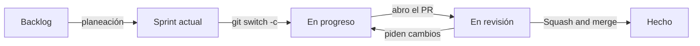

# Guía de Trello — RepuAuto

En Trello está el tablero del equipo: ahí se ve qué está haciendo cada uno y en qué estado va cada tarea. El Excel lleva los puntos, las horas y el burndown. **Los dos se actualizan juntos.**

El tablero no es público. Si no tienes acceso, pídele la invitación a Santiago por el grupo.

## 1. Las listas del tablero

| Lista | Qué hay | Quién mueve la tarjeta aquí | Cuándo |
|---|---|---|---|
| **Backlog** | Todas las tareas que aún no están en el sprint | El equipo, al crear el tablero | Una vez |
| **Sprint actual** | Las tareas del sprint en curso | El equipo, en la planeación del sprint | Al iniciar cada sprint |
| **En progreso** | Lo que cada uno está haciendo ahora | El responsable | Al crear la rama de la tarea |
| **En revisión** | Tareas con el PR abierto | El responsable | Al abrir el PR ([guía de git](../../GUIA-GIT.md) §5) |
| **Hecho** | Tareas que cumplen la [definición de terminado](../../PLAN-DE-TRABAJO.md#definición-de-terminado) | El responsable | Al unir el PR a `main` |

**Una persona no debería tener más de dos tarjetas en *En progreso*.** Si tienes más, termina una antes de empezar otra.

## 2. Crear las tarjetas (una sola vez)

Las tarjetas ya están escritas en el Excel, en la hoja **Tarjetas Trello**. Trello crea una tarjeta por cada línea que pegues:

1. En el Excel, copia la columna **TARJETA (TÍTULO PARA PEGAR)** de un sprint. Por ejemplo, las 19 filas del sprint 1.
2. En Trello, en la lista **Backlog**, haz clic en **Añadir una tarjeta** y pega.
3. Trello pregunta si quieres crear una tarjeta por línea. Elige **Crear 19 tarjetas**.
4. Repite para los sprints 2 y 3.

## 3. Etiquetas y miembros

**Etiquetas** (menú **… → Etiquetas** del tablero):

| Etiqueta | Color sugerido | Para qué |
|---|---|---|
| `Sprint 1` | Verde | Tareas del sprint 1 |
| `Sprint 2` | Amarillo | Tareas del sprint 2 |
| `Sprint 3` | Naranja | Tareas del sprint 3 |
| `Migración` | Rojo | Tareas que crean tablas: US-01 T1, US-04 T1, US-02 T1, US-03 T1, US-06 T1 y US-09 T1. Van primero y se revisan el mismo día |
| `Bloqueada` | Morado | La tarea espera a otra ([¿Quién espera a quién?](../../PLAN-DE-TRABAJO.md#quién-espera-a-quién)) |

**Miembros:** a cada tarjeta se le asigna su responsable, según la columna **RESPONSABLE** del Excel.

## 4. Qué lleva cada tarjeta

- **Título:** el mismo del Excel, por ejemplo `US-02 T2 · CRUD de clientes (crear, editar, ver detalles)`. **No lo cambies**: el código `US-02 T2` es el que une la tarjeta con la rama, los commits y el PR.
- **Descripción:** los criterios de aceptación de la historia que toca esta tarea, copiados de la hoja *User Stories*.
- **Fecha de vencimiento:** opcional. Úsala si la tarea bloquea a alguien.
- **Adjunto:** el enlace al PR, que se pega al pasar la tarjeta a *En revisión*.

## 5. El recorrido de una tarjeta

Al llegar a **Hecho**, en el Excel:

1. cambia el **ESTADO** a `DONE`;
2. anota las **Horas reales**;
3. escribe los **puntos** de la tarea en la columna de la semana en que terminó.

## 6. Cada viernes

- Revisa que tus tarjetas estén en la lista correcta.
- En el Excel, actualiza el **ESTADO** y las **Horas reales** de tus tareas.
- Si una tarea lleva más de una semana en *En progreso*, avisa en el grupo: puede que necesite ayuda o dividirse.

## 7. Evidencias

Al cerrar cada sprint, se toma una captura del tablero y se guarda en `docs/evidencias/` con el nombre `sprint-N-trello.png`. También se toma una captura del burndown del Excel, con el nombre `sprint-N-burndown.png`. Ver [EVIDENCIAS.md](../../EVIDENCIAS.md).

---

_Última actualización: 2026-09-29_
